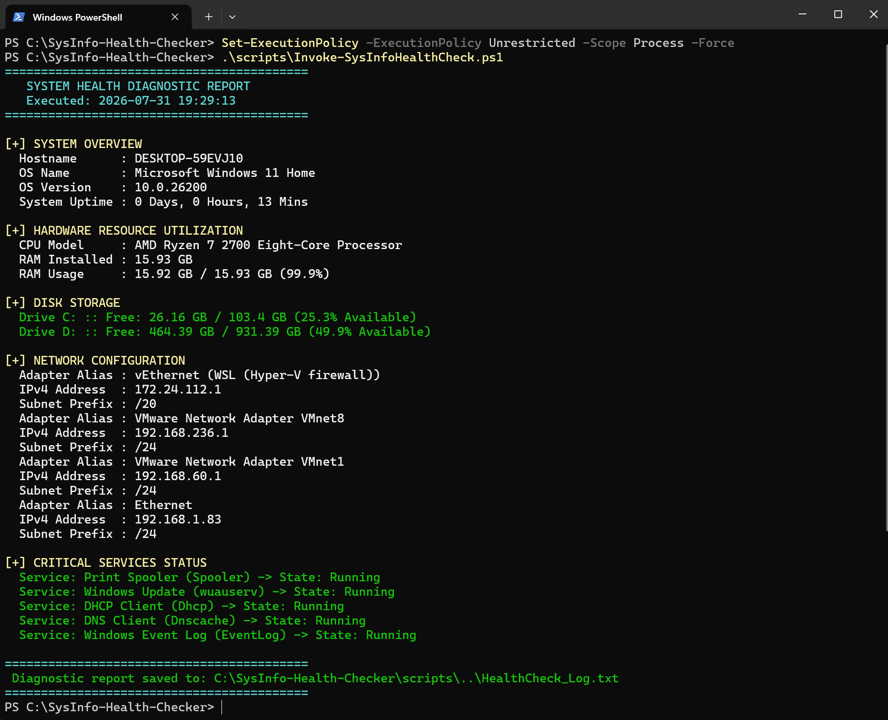
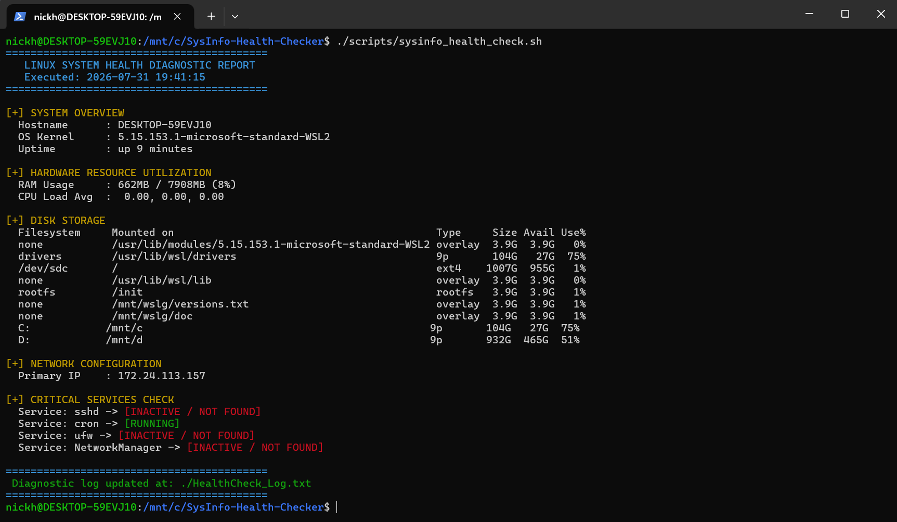
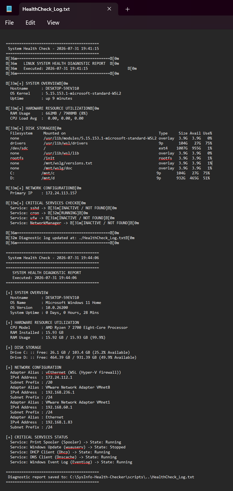

# SysInfo Health Checker (PowerShell & Bash)

## 📌 Project Overview
The **SysInfo Health Checker** is a lightweight, cross-platform endpoint diagnostic tool engineered for Help Desk and Systems Administration teams. It automates system diagnostic checks across Windows and Linux environments, printing hardware utilization, networking, disk capacity, and service health metrics directly to the console while writing persistent audit logs to disk.

---

## 🛠️ Features & Functionality
* **Hardware Resource Monitoring:** Calculates RAM utilization percentage and identifies CPU specs/load averages.
* **Disk Capacity Alerting:** Scans system drives and highlights volumes with under 15% free disk space.
* **Network Adapter Querying:** Retrieves active IPv4 configuration, subnets, and host network parameters.
* **Service State Auditing:** Monitors essential operating system services (e.g., Print Spooler, DNS Client, Windows Update, SSH, UFW Firewall).
* **Automated Audit Logging:** Appends clean, timestamped output logs to a persistent `.txt` audit file for record-keeping.

---

## 📂 Repository Structure
```
SysInfo-Health-Checker/
│
├── .gitignore
├── README.md
├── HealthCheck_Log.txt (Generated upon script execution)
│
├── scripts/
│   ├── Invoke-SysInfoHealthCheck.ps1   # Windows PowerShell Script
│   └── sysinfo_health_check.sh         # Linux Bash Script
│
└── images/
├── 01-powershell-output.png
├── 02-bash-output.png
└── 03-logfile-proof.png
```
---

## 🚀 Usage & Execution Guide

### Windows (PowerShell)
1. Open PowerShell as Administrator.
2. Navigate to the script directory and execute:
   ```powershell
   Set-ExecutionPolicy -ExecutionPolicy Unrestricted -Scope Process -Force
   .\scripts\Invoke-SysInfoHealthCheck.ps1
   ```
### Linux (Bash)
1. Open Terminal.
2. Grant execution permissions and run:
   ```bash
   chmod +x scripts/sysinfo_health_check.sh
   ./scripts/sysinfo_health_check.sh
   ```
## 📸 Proof of Work & Verification
### 1. Windows PowerShell Health Check Output
   
### 2. Linux Bash Health Check Output
   
### 3. Automated Diagnostic Audit Log File
   
